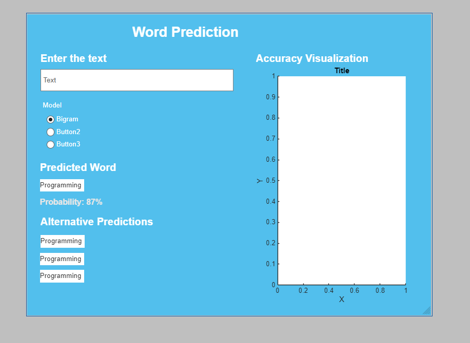

# Word Prediction System

A MATLAB-based next word prediction system that implements and compares multiple natural language processing techniques for predicting the next word in a sequence.

## 📋 Overview

This project develops a word prediction system that analyzes text corpora and uses machine learning models to predict the next word given a context. It implements two distinct approaches:

1. **N-gram Model (Bigram)** - Statistical approach using word co-occurrence probabilities
2. **Vector Model** - Distributional semantics using co-occurrence matrices and cosine similarity

## ✨ Features

- **Text Preprocessing Pipeline**: Cleaning, tokenization, and vocabulary building
- **Multiple Prediction Models**: Bigram and vector-based models
- **Model Evaluation**: Accuracy and perplexity metrics
- **Interactive UI**: User-friendly application for real-time word predictions
- **Visualization Tools**: Word frequency analysis and model performance visualization
- **Configurable Parameters**: Centralized configuration for easy tuning



## 📁 Project Structure

```
Word_Prediction/
├── config.m                         # Central configuration file
├── main.m                           # Main pipeline execution
├── readme.md                        # This file
│
├── data/                            # Data directory
│   ├── corpus.txt                   # Input text corpus
│   └── processed_data.mat           # Preprocessed data cache
│
├── preprocessing/                   # Text preprocessing module
│   ├── loadText.m                   # Load text from file
│   ├── cleanText.m                  # Text cleaning (lowercase, punctuation)
│   ├── tokenizeText.m               # Word tokenization
│   ├── buildVocabulary.m            # Create vocabulary from tokens
│   └── wordFrequency.m              # Calculate word frequencies
│
├── ngram/                           # N-gram model module
│   ├── buildBigramModel.m           # Build bigram count matrix
│   ├── calculateProbabilities.m     # Compute bigram probabilities
│   ├── predictNextWordBigram.m      # Predict using bigram model
│   └── smoothing.m                  # Laplace smoothing implementation
│
├── vector/                          # Vector model module
│   ├── buildCoOccurrenceMatrix.m    # Build co-occurrence matrix
│   ├── oneHotEncoding.m             # One-hot encoding for words
│   ├── cosineSimilarity.m           # Cosine similarity computation
│   └── predictNextWordVector.m      # Predict using vector model
│
├── evaluation/                      # Model evaluation module
│   ├── splitDataset.m               # Train/test split
│   ├── calculateAccuracy.m          # Accuracy metric
│   ├── calculatePerplexity.m        # Perplexity metric
│   └── compareModels.m              # Compare model performance
│
├── ui/                              # User interface
│   └── predictionApp.m              # Interactive prediction application
│
├── visualization/                   # Visualization tools
│   ├── plotWordFrequency.m          # Plot word frequency distribution
│   └── plotVocabularyStats.m        # Vocabulary statistics visualization
│
├── models/                          # Saved model files
│   ├── bigramModel.mat              # Serialized bigram model
│   └── vectorModel.mat              # Serialized vector model
│
└── docs/                            # Documentation directory
```

## 🚀 Getting Started

### Prerequisites

- MATLAB R2020a or later
- Basic NLP knowledge (optional)

### Installation

1. Clone or download this repository
2. Open MATLAB and navigate to the project directory
3. The project uses relative paths, so ensure you run from the main directory

### Running the Pipeline

```matlab
% Run the complete pipeline
main()

% Run without UI
main(false)
```

This executes:

1. Text loading and preprocessing
2. Vocabulary building and frequency analysis
3. Model training (Bigram and Vector models)
4. Model evaluation and comparison
5. Optional interactive UI launch

## 📊 Models Explained

### 1. Bigram Model (N-gram Approach)

**How it works:**

- Counts occurrences of word pairs (bigrams) in the training data
- Calculates conditional probability: P(word₂|word₁)
- Uses Laplace smoothing to handle unseen bigrams
- Prediction: Given a word, returns the most probable next word

**Advantages:**

- Simple and interpretable
- Fast inference
- No dimensionality issues

**Limitations:**

- Limited context (only one previous word)
- Sparse for large vocabularies
- May not capture semantic relationships

### 2. Vector Model (Co-occurrence Matrix)

**How it works:**

- Builds a co-occurrence matrix from a context window
- Each word is represented as a vector (its row in the matrix)
- Uses cosine similarity to find semantically similar words
- Prediction: Finds words similar to the context pattern

**Advantages:**

- Captures semantic relationships
- Handles unseen words better
- Can leverage distributional semantics

**Limitations:**

- Higher computational cost
- Requires more data for reliable statistics
- Denser representation

## ⚙️ Configuration

Edit `config.m` to customize parameters:

```matlab
cfg.dataPath = '';              % Path to input corpus
cfg.processedPath = '';         % Cache for processed data
cfg.splitRatio = 0.8;          % Train/test split ratio
cfg.smoothingAlpha = 1;        % Laplace smoothing parameter
cfg.coWindowSize = 2;          % Context window size
cfg.topWords = 10;             % Number of top words to display
```

## 💻 Usage Examples

### Interactive UI

```matlab
main()  % Launches the prediction app GUI
```

### Programmatic Prediction

```matlab
% Setup
tokens = tokenizeText(cleanText(loadText('data/corpus.txt')));
vocab = buildVocabulary(tokens);

% Bigram prediction
bigramModel = buildBigramModel(tokens, vocab);
prediction = predictNextWordBigram('hello', bigramModel, vocab);

% Vector prediction
coMat = buildCoOccurrenceMatrix(tokens, vocab, 2);
prediction = predictNextWordVector('hello', coMat, vocab);
```

### Model Evaluation

```matlab
[trainTokens, testTokens] = splitDataset(tokens, 0.8);
results = compareModels(testTokens, bigramModel, coMat, vocab, 1);

fprintf('Bigram Accuracy: %.4f\n', results.bigramAccuracy);
fprintf('Vector Accuracy: %.4f\n', results.vectorAccuracy);
```

## 📈 Visualization

The system provides several visualization tools:

```matlab
% Word frequency plot
[freqWords, freqCounts] = wordFrequency(tokens);
plotWordFrequency(freqWords(1:20), freqCounts(1:20));

% Vocabulary statistics
plotVocabularyStats(tokens);
```

## 📊 Evaluation Metrics

- **Accuracy**: Percentage of correct top-1 predictions
- **Perplexity**: Measure of model uncertainty (lower is better)
- **Comparison**: Side-by-side evaluation of both models

## 🔧 Key Functions

| Function                    | Module        | Purpose                   |
| --------------------------- | ------------- | ------------------------- |
| `loadText()`                | preprocessing | Load corpus file          |
| `cleanText()`               | preprocessing | Normalize and clean text  |
| `tokenizeText()`            | preprocessing | Split into words          |
| `buildVocabulary()`         | preprocessing | Create word inventory     |
| `buildBigramModel()`        | ngram         | Train bigram model        |
| `buildCoOccurrenceMatrix()` | vector        | Create word vectors       |
| `predictNextWordBigram()`   | ngram         | Predict with bigram       |
| `predictNextWordVector()`   | vector        | Predict with vector model |
| `compareModels()`           | evaluation    | Evaluate both models      |
| `predictionApp()`           | ui            | Launch interactive UI     |

## 💡 Tips for Best Results

1. **Data Quality**: Clean, large corpus produces better predictions
2. **Vocabulary Size**: Balance between coverage and sparsity
3. **Window Size**: Larger windows capture more context but increase computation
4. **Smoothing**: Adjust `smoothingAlpha` based on data sparsity
5. **Train/Test Split**: 80/20 is a good default

## 🐛 Troubleshooting

| Issue                 | Solution                                   |
| --------------------- | ------------------------------------------ |
| File not found errors | Ensure you run from project root directory |
| Out of memory         | Reduce corpus size or increase smoothing   |
| Poor predictions      | Try larger corpus or adjust window size    |
| UI won't load         | Verify MATLAB UI components are available  |

## 📝 Assignment Information

- **Course**: I3-GIC-1B, Semester 2
- **Topic**: Natural Language Processing - Word Prediction
- **Institution**: [Your Institution]

## 🤝 Contributing

To extend this project:

- Add new preprocessing techniques in `preprocessing/`
- Implement new models in dedicated modules
- Add evaluation metrics to `evaluation/`
- Enhance UI in `ui/predictionApp.m`

## 📚 References

- Manning & Schütze (1999): Foundations of Statistical NLP
- Turney & Pantel (2010): From Frequency to Meaning
- MATLAB NLP Documentation

## ⚖️ License

This is an educational project.

---

**Last Updated**: May 13, 2026

For questions or issues, refer to the documentation in the `docs/` folder or review the comments in individual MATLAB files.
